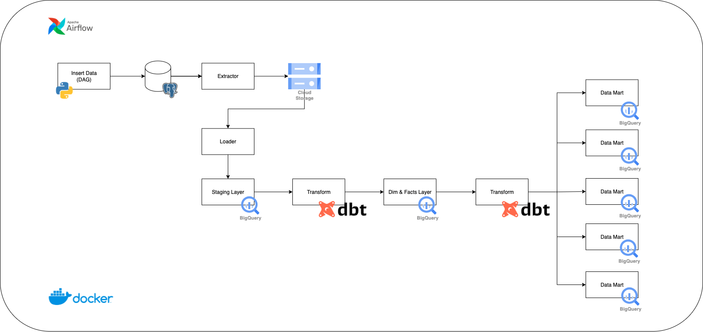

# Ecommerce Data Pipeline and Analysis

This project implements a complete data engineering workflow for processing and analyzing e-commerce data using batch (ELT) and streaming pipelines. It automates data ingestion from PostgreSQL to Google BigQuery using Airflow, transforms data using dbt, and delivers insights via Looker Studio dashboards.

---

## 📂 Configuration & Secrets

- Store your GCP credentials in: `config/`
- Airflow variables and SMTP secrets are stored securely via environment or Airflow UI.

---

## 🎯 Objectives

- Build scheduled data pipelines using **Airflow + Docker**
- Automate data loading to **PostgreSQL** using Python
- Extract data from PostgreSQL → **GCS**
- Load data from GCS → **BigQuery**
- Transform data using **dbt** into multiple layers:
  - Staging
  - Dimension & Fact
  - Datamart
- Visualize insights using **Looker Studio**
- Enable real-time alerts via **SMTP Email Notification**

---

## 🏗️ Project Structure

```bash
├── airflow/                      
│   ├── dags/                     # All Airflow DAGs
│   │   ├── load_postgresql.py
│   │   ├── extract_postgres_to_gcs.py
│   │   ├── load_gcs_to_bq.py
│   │   ├── transform_dimfact.py
│   │   └── transform_datamart.py
│   ├── plugins/
│   ├── Dockerfile
│   └── requirements.txt
│
├── dbt_script/                          
│   ├── models/
│   │   ├── dim_table/
│   │   ├── fact_table/
│   │   └── data_mart/
│   ├── dbt_project.yml
│   └── profiles.yml
│
├── script/
│   └── main.py         # Python script to insert dummy data into PostgreSQL
│
├── config/
│   └── key.json                  # GCP service account key
│
├── datamaster/
│   └── customer.csv, etc
│
├── docker-compose.yml
└── README.md
```

---

## Architecture Overview



---

## How to Run

### Batch (ELT) Pipeline

1. **Start Build Docker**
   ```bash
   docker-compose build
   ```

2. **Start Airflow with Docker**
   ```bash
   docker-compose up -d
   ```

3. **Trigger DAG**
   - Open Airflow UI at `http://localhost:8080`
   
   In Airflow UI, manually trigger the following DAGs sequentially:

   1. `load_postgresql` (optional if you run the script manually)
   2. `extract_postgres_to_gcs`
   3. `load_gcs_to_bq`
   4. `transform_dimfact`
   5. `transform_datamart`

---

### View Dashboard

Open your [Looker Studio](https://lookerstudio.google.com/reporting/d4e2a9ba-5e40-45eb-8298-30b6eebfa445) dashboard (linked manually).

Metrics visualized:

- Total Sales & Revenue Trends
- Top Selling Products
- Customer Transaction Behavior
- Payment Preferences
- Channel & Store Performance

---

### Email Notification

If any Airflow task fails, you will receive an email with:

- DAG and task names
- Error message and exception
- Execution timestamp
- Log URL (Airflow UI)

Configured via Airflow callbacks with SMTP (`send_email_smtp`).

---

## Data Warehouse Layers

### Staging Layer (`stg_*`)
Raw structured data from GCS → BigQuery.

### Core Layer (Fact & Dimension)
Standardized data for relationships and metrics:

- `fact_transaction`, `fact_review`
- `dim_customer`, `dim_product`, `dim_payment`, `dim_session`

### Datamart Layer (`marts_*`)
Aggregated tables for analytics use cases:

- `marts_customer_product_summary`
- `marts_payment_transaction_summary`
- `marts_review_product_summary`
- `marts_session_transaction_summary`

---

## Future Improvements

- ✅ Add data validation with **dbt test** or **Great Expectations**
- 🔁 Use **parameterized DAGs** and Jinja templating
- 🚀 Implement **CI/CD** for dbt and Airflow (GitHub Actions)
- 📈 Integrate basic **predictive ML models**
- ☁️ Migrate Airflow to **Cloud Composer**
- 🔎 Improve monitoring with **Stackdriver** or **Prometheus**

---

## Conclusion

This project delivers a structured and automated data pipeline for e-commerce analytics. From ingestion to visualization, the solution empowers decision-makers with near real-time business insights. The architecture is modular, scalable, and ready for production deployment or advanced analytics use cases.
